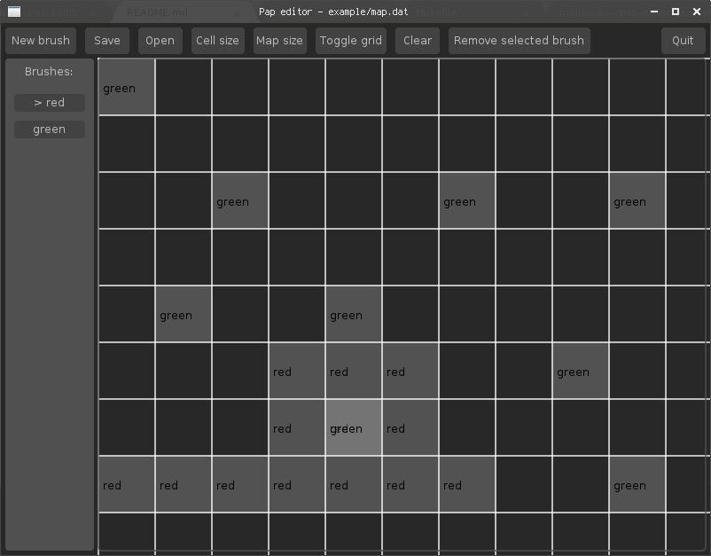

# Pap

Pap is a simple map editor written [löve](https://love2d.org), that can be used with löve as well as in plain lua

# Installation

On Linux/Mac (you need to have the love binary installed and in your path):

`make`

`sudo make install`

This will install pap to `/usr/bin/pap`

On Windows:

Follow the instructions [here](https://love2d.org/wiki/Game_Distribution#Creating_a_Windows_Executable) to create an executable and put it in your desktop or whatever

# Usage

The editor works with brushes; you don't import spritesheets, you just paint some tiles with different brushes and then you implement it how you want (see Lib)

Use left click to paint with the selected brush and right click to remove, and mouse over a tile and press left shift to edit tile data

Because there is no api for file open dialogs in löve, to open a file you can drop it into the window or click 'Open' and specify the path to the file.

# Lib

As previously mentioned, pap doesn't use tilesets or spritesheets to make the maps, it just specifies tile locations of a brush (a brush is like a layer)

If you want to use pap in your project, just copy the `pap.lua` file into your project and require it with `pap = require("pap")`

### Functions

#### Pap

`pap.fromFile(path, useLfs)`

Returns a Map read from `path`, uses `love.filesystem.load()` by default when love exists and useLfs != false, otherwise it uses `loadfile()`

`pap.fromData(data)`

Returns a Map read from the data provided, this is useful if you want to hardcode a small map inside your game

`pap.new()`

Returns a blank new Map

Calling `pap()` is an alias to `pap.new()`

#### Map

A brush can be a string (brush name) or a number (brush index)
(see `Map:brushIndex()`)

`Map:forEach(brush, cb)`

Applies callback to brush. The callback takes two parameters `(x, y)` which determine the position of the tile in the map, if you want to draw them to the screen you'll have to multiply x and y by the tile size

`Map:setData(x, y, brush, value)`

Changes the tile of the brush `brush` in position `x, y` in the map to value, pass `nil` as value if you want to remove a tile

`Map:getData(x, y, brush)`

Returns the tile of the brush `brush` in position `x, y` in the map, by default it will be `nil` if it doesn't exist and `1` if it exists

`Map:newBrush(brush)`

Self explanatory

`Map:brushIndex(brush)`

Because brushes are internally stored as numbers, this function "translates" a brush name to it's index, if it's a number already then it returns brush. This function is used internally

`Map:removeBrush(brush)`

Removes brush and all data associated to it